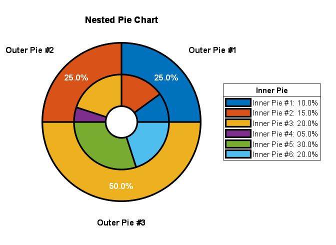
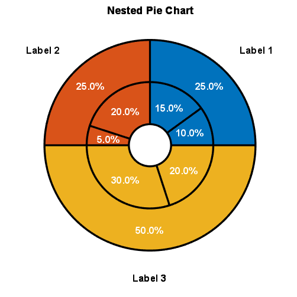

[](https://www.mathworks.com/matlabcentral/fileexchange/122167-pie_nested)

# pie_nested
Create a nested pie chart.

## Syntax:
**pie_nested(C)**

**pie_nested(C, Name, Value, ...)**

**h = pie_nested(_)**

## Input Arguments:
*(Required)*

- **C** - The data points used to plot the nested pie chart. It is a nested cell array of numerical values, starting with the inner most going to the outer most part of the pie chart.
          [nested cell]

## Output Arguments:
*(Optional)*
- **h**                - Figure handle of pie chart.
                         [figure object]

## Name-Value Pair Arguments:
*(Optional)*

- **RhoLower**       -  Used to specify the starting radius of the inner most nested pie chart.
                        [0.2 (default) | scalar value between (0, 1)]

- **EdgeColor**       - Used to specify the edge color of the wedges.
                        [black (default) | RGB triplet | hexadecimal color code]

- **LineWidth**       - Used to specify the edge line width of the wedges.
                        [2 (default) | scalar value]

- **LineStyle**       - Used to specify edge line style of the wedges.
                        ['-' (default) | '--' | ':' | '-.' | 'none']

- **WedgeColors**     - Used to specify the colors of the individual wedges.
                        [lines colormap (default) | cell array of RGB triplets]

- **PercentStatus**   - Used to specify whether or not to display percentage text.
                        [{'on'} (default) | {'off'} | cell array of percent statuses]

- **PercentPrecision**- Used to specify the percentage text decimal places.
                        [1 (default) | integer value]

- **PercentFontColor**- Used to specify the percentage text font color.
                        [white (default) | RGB triplet | hexadecimal color code]

- **PercentFontSize** - Used to specify the percentage text font size.
                        [10 (default) | scalar value]

- **PercentFontWeight**- Used to specify the percentage text font weight.
                        [bold (default) | 'normal']

- **PercentEdgeColor**- Used to specify the percentage text box edge color.
                        [none (default) | RGB triplet | hexadecimal color code]

- **PercentBackgroundColor**- Used to specify the percentage text box background color.
                        [white (default) | RGB triplet | hexadecimal color code]

- **LabelFontSize**   - Used to specify the font size of the labels.
                        [10 (default) | scalar value]

- **LabelFontColor**  - Used to specify the font color of the labels.
                        [white (default) | RGB triplet | hexadecimal color code]

- **LabelFontWeight** - Used to specify the font weight of the labels.
                        [bold (default) | 'normal']

- **LabelEdgeColor**  - Used to specify the edge color of the labels.
                        [none (default) | RGB triplet | hexadecimal color code]

- **LabelBackgroundColor**- Used to specify the background color of the labels.
                        [white (default) | RGB triplet | hexadecimal color code]

- **LabelRotation**   - Used to specify the rotation of the labels.
                        [0 | scalar value]

- **LabelOffset**     - Used to specify the radial offset of the labels.
                        [0 | scalar value]

- **LabelInterpreter**- Used to specify the interpreter of the labels.
                        ['none' | 'tex' | 'latex']

- **FillTransparency**- Used to specify the fill transparency of the wedges.
                        [scalar value between (0, 1)]

## Examples:
### Example 1: Nested pie chart
```matlab
% Initialize data points
inner_pie = [0.1, 0.15, 0.2, 0.05, 0.3, 0.2];
outer_pie = [0.25, 0.25, 0.5];
C = {...
    inner_pie,... % Inner pie must come first!
    outer_pie};

% Spider plot
pie_nested(C,...
    'PercentStatus', {'off', 'on'});

% Title
title('Nested Pie Chart');

% Legend properties
legend_str = cell(length(inner_pie), 1);
for ii = 1:length(legend_str)
    inner_value = inner_pie(ii);
    legend_str{ii} = sprintf('Inner Pie #%i: %.1f%%', ii, inner_value*100);
end
lg =legend(legend_str, 'Location', 'eastoutside');
lg.Title.String = 'Inner Pie';
```
<p align="center">
  
</p>

### Example 2: Nested pie chart with custom colors for each wedge
```matlab
% Initialize data points
inner_pie = [0.1, 0.15, 0.2, 0.05, 0.3, 0.2];
outer_pie = [0.25, 0.25, 0.5];
C = {...
    inner_pie,... % Inner pie must come first!
    outer_pie};

% Custom colors
inner_colors = [...
    0 0.4470 0.7410;...
    0 0.4470 0.7410;...
    0.8500 0.3250 0.0980;...
    0.8500 0.3250 0.0980;...
    0.9290 0.6940 0.1250;...
    0.9290 0.6940 0.1250];
outer_colors = [...
    0 0.4470 0.7410;...
    0.8500 0.3250 0.0980;...
    0.9290 0.6940 0.1250];
wedge_colors = {...
    inner_colors,...
    outer_colors};

% Spider plot
pie_nested(C,...
    'WedgeColors', wedge_colors);

% Title
title('Nested Pie Chart');
```
<p align="center">
  
</p>

### Example 3: Thin pie chart
```matlab
% Initialize data points
inner_pie = [0.1, 0.15, 0.2, 0.05, 0.3, 0.2];
C = {inner_pie};

% Spider plot
pie_nested(C,...
    'RhoLower', 0.7);

% Title
title('Nested Pie Chart');
```
<p align="center">
  
</p>

### Example 4: Multi-layer nested pie chart
```matlab
% Initialize data points
inner_pie = [0.1, 0.15, 0.2, 0.05, 0.3, 0.2];
middle_pie = [0.2, 0.05, 0.1, 0.1, 0.05, 0.1, 0.2, 0.2];
outer_pie = [0.25, 0.25, 0.5];
C = {...
    inner_pie,... % Inner pie must come first!
    middle_pie,...
    outer_pie};

% Spider plot
pie_nested(C,...
    'PercentStatus', {'off', 'off', 'off'});

% Title
title('Nested Pie Chart');
```
<p align="center">
  
</p>

## Author:
Moses Yoo, (juyoung.m.yoo at gmail dot com)

## Special Thanks:
Special thanks to the following people for their feature recommendations and bug finds.

[](https://www.mathworks.com/matlabcentral/fileexchange/122167-pie_nested)